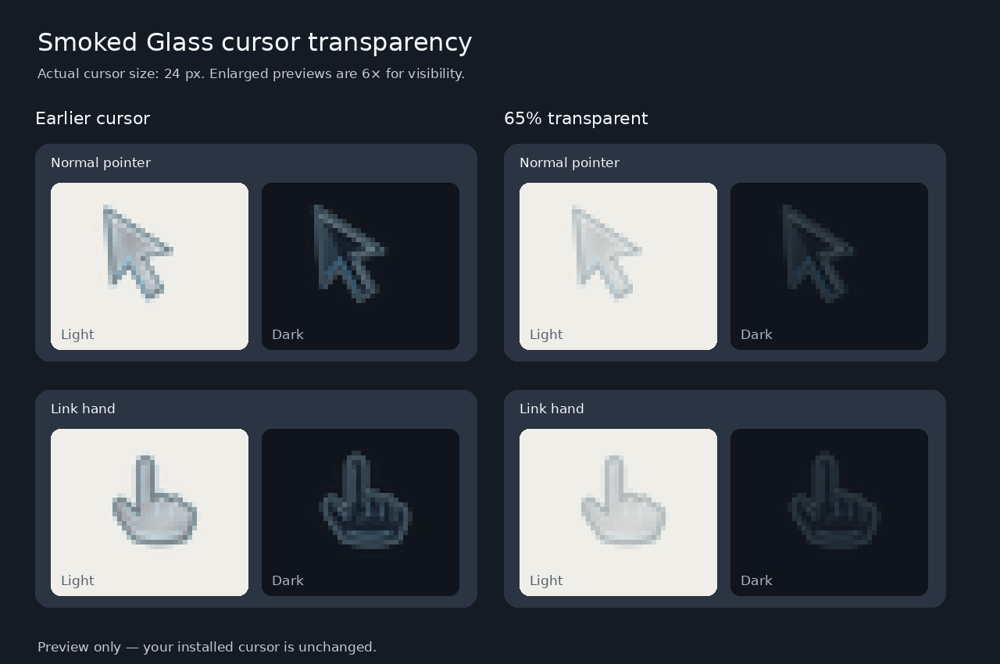

# Smoked Glass cursor — 65% transparent

A translucent Linux XCursor theme with 23 cursor states, 24/32/48/64 px sizes, and animated busy and progress cursors. Every pixel has 35% of the opacity of the original Smoked Glass design. Hotspots, shapes, sizes, and animations are unchanged.



## Install on GNOME Linux

Clone this repository, then run:

```sh
./install.sh
```

The script installs the theme for your user and selects it in GNOME. It does not require `sudo` or remove other cursor themes. Fully quit and reopen apps that still show an old cursor.

To select the theme manually, choose **Smoked-Glass-65** in your cursor settings.

## Contents

- `Smoked-Glass-65.tar.gz` — ready-to-use XCursor theme, including common cursor aliases
- `install.sh` — user-level installer
- `preview.png` — light and dark background comparison at six times display size

The archive contains the full theme and preserves its cursor aliases. The artwork uses transparent backgrounds. Transparency blends with the screen; it does not refract or blur content behind the cursor.
